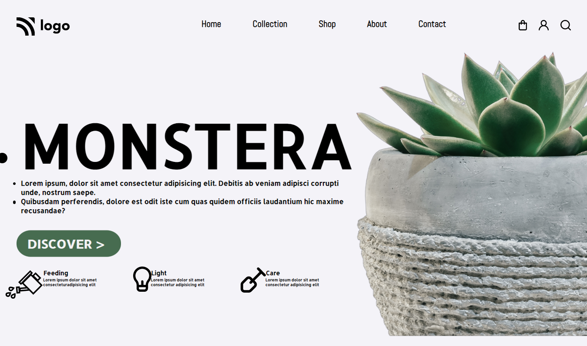
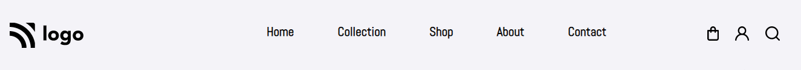
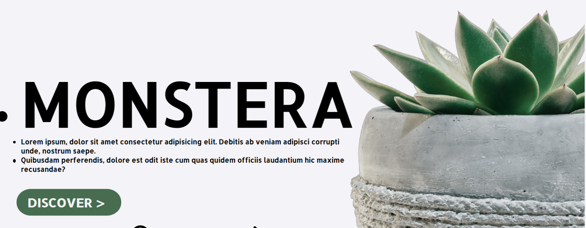
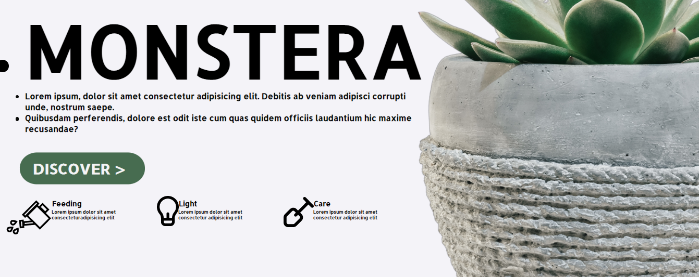

# PROJECT NO. 6

This is my Sixth project of Web Development. In this project I have learnt a lot of new concepts of CSS like flexbox, display property, flex direction, float property, hovering effects etc. 

FULL WEBPAGE:

NAVBAR:

BODY:

## Technologies Used

## What I leaned

- How to work with images.
- FLex-box.
- Display properties.
- Flex direction: Flex-row, FLex-column.
- Border-radius property of CSS.

# Connect with me

   &ensp;
  &ensp;
  &ensp;
  
